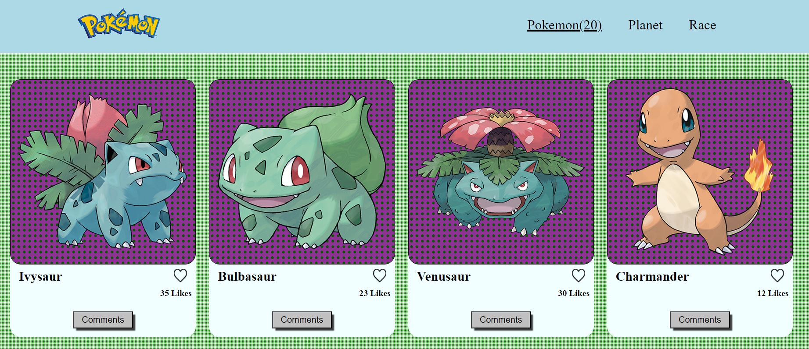

  
   
  <h3><b>Pokedex - Group Capstone -  Module 2</b></h3>

<!-- TABLE OF CONTENTS -->

# 📗 Table of Contents

- [📖 About the Project](#about-project)
  - [🛠 Built With](#built-with)
    - [Tech Stack](#tech-stack)
    - [Key Features](#key-features)
  - [🚀 Live Demo](#live-demo)
- [💻 Getting Started](#getting-started)
  - [Setup](#setup)
  - [Prerequisites](#prerequisites)
  - [Install](#install)
  - [Usage](#usage)
  - [Run tests](#run-tests)
  - [Deployment](#deployment)
- [👥 Authors](#authors)
- [🔭 Future Features](#future-features)
- [🤝 Contributing](#contributing)
- [⭐️ Show your support](#support)
- [🙏 Acknowledgements](#acknowledgements)
- [❓ FAQ (OPTIONAL)](#faq)
- [📝 License](#license)

<!-- PROJECT DESCRIPTION -->

# 📖 Pokedex - Module 2 Capstone 

**Pokedex - Module 2 Capstone** is a simple Pokemon list web application using an existing API.

This project is a basic website that allows users see a list of pokemons in cards. Inside the cards the users are allowed to like the pokemon or add in the popup window displayed when clicking the comment button.

## 🛠 Built With 

### Tech Stack 

  
Client

  <ul>
    <li><a href="https://HTML.org/">HTML</a></li>
    <li><a href="https://css.org/">CSS</a></li>
    <li><a href="https://javascript.org/">JavaScript</a></li>
  </ul>

### Key Features 

- **Use of APIs**
- **POST/GET methods with APIs**
- **Kanvan Board**

(<a href="#readme-top">back to top</a>)

<!-- LIVE DEMO -->

## 🚀 Live Demo 

- Coming Soon!

(<a href="#readme-top">back to top</a>)

<!-- GETTING STARTED -->

## 💻 Getting Started 

To get a local copy up and running, follow these steps.

### Prerequisites

In order to run this project you need:

* Only clone the repo and run in your local

### Setup

Clone this repository to your desired folder:

https://github.com/JuanDiegoGuerra/Module_2-Capstone.git

### Install

<!-- Install this project with: -->

Clone this repository to your desired folder:

https://github.com/JuanDiegoGuerra/Module_2-Capstone.git

### Usage

To run the project, execute the following command:

git clone https://github.com/JuanDiegoGuerra/Module_2-Capstone.git

### Run tests

To run tests, run the following command:

No implemented yet.

### Deployment

You can deploy this project using:

GH Pages, publish the branch in git Hub pages

(<a href="#readme-top">back to top</a>)

<!-- AUTHORS -->

## 👥 Authors 

👤 **Juan Diego Guerra (JD)**

- GitHub: [@Juan Diego](https://github.com/JuanDiegoGuerra)
- Twitter: [@twitterhandle](https://twitter.com/twitterhandle)
- LinkedIn: [LinkedIn](https://linkedin.com/in/linkedinhandle)

👤 **Lincoln Gibson**

- GitHub: [@Lincoln Gibson](https://github.com/lincoln1883)
- Twitter: [@twitterhandle](https://twitter.com/twitterhandle)
- LinkedIn: [LinkedIn](https://linkedin.com/in/linkedinhandle)

(<a href="#readme-top">back to top</a>)

<!-- FUTURE FEATURES -->

## 🔭 Future Features 

- [ ] **Better Navigation**
- [ ] **Render extra information**
- [ ] **Add Contact section**

(<a href="#readme-top">back to top</a>)

<!-- CONTRIBUTING -->

## 🤝 Contributing 

Contributions, issues, and feature requests are welcome!

Feel free to check the [issues page](../../issues/).

(<a href="#readme-top">back to top</a>)

<!-- SUPPORT -->

## ⭐️ Show your support 

If you like this project...
Please give a ⭐ to the repo and follow us.

(<a href="#readme-top">back to top</a>)

<!-- ACKNOWLEDGEMENTS -->

## 🙏 Acknowledgments 

I would like to thank my coding partner for putting a lot of effort building this project with me!

(<a href="#readme-top">back to top</a>)

<!-- FAQ (optional) -->

<!-- ## ❓ FAQ (OPTIONAL) 

> Add at least 2 questions new developers would ask when they decide to use your project.

- **[Question_1]**

  - [Answer_1]

- **[Question_2]**

  - [Answer_2]

(<a href="#readme-top">back to top</a>)
 -->

<!-- LICENSE -->

## 📝 License 

This project is [MIT](./LICENSE) licensed.

(<a href="#readme-top">back to top</a>)
